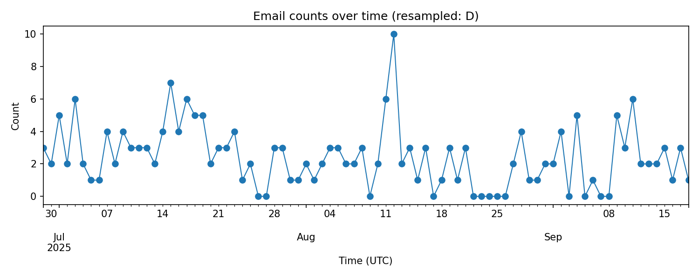

# Email Analysis Report

- Total messages processed: **200**

## Category counts

- promotion: 159

- work: 17

- transaction: 9

- security: 8

- notification: 4

- personal: 2

- business: 1

## Priority counts

- low: 151

- high: 30

- medium: 19

## Action required counts

- 0: 167

- 1: 33

## Charts

- **Category distribution**: 

- **Priority distribution**: 

- **Action required**: 

- **Emails over time**: 

- **Priority by category**: 

## Next steps / suggestions

- Manually inspect `samples_action_required.csv` and `samples_high_priority.csv` to verify label correctness.
- If many promotions are misclassified, tune the promo-detection rules or prompt examples used in labeling.
- Consider marking messages with low confidence for manual review and possible fine-tuning.
- After verification, implement automation (move promos to archive/folder, surface high-priority items in daily digest).
